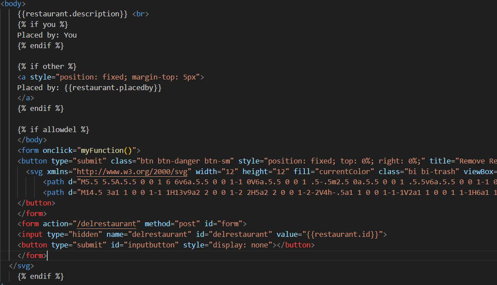
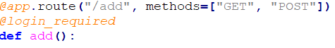
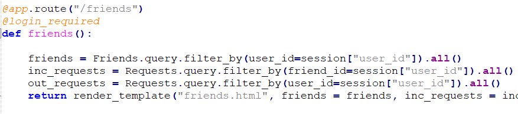
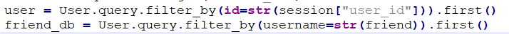
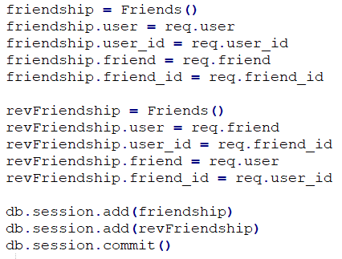
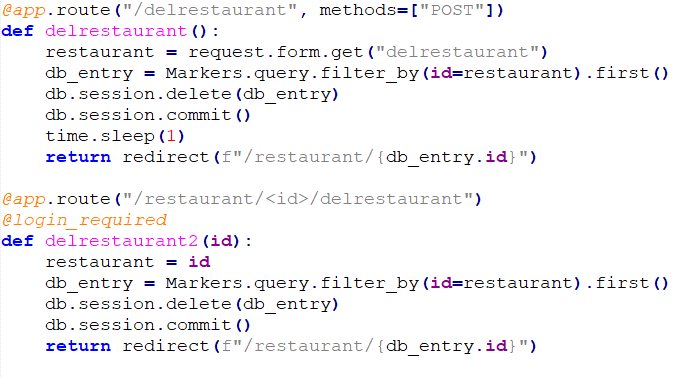

## Project Code Review Wouter
Samengewerkt met: Ron Lakeman en Sunshine Landvreugd.

Uit de review zijn niet per se grote problemen of verbeterpunten direct naar boven gekomen. Natuurlijk zijn er een aantal verbeteringen die Ik kon toepassen:

### Netheid HTML code

De netheid van mijn HTML code was niet erg on-point. Het is voornamelijk een flink onduidelijke bende als het gaat om het aantal tabs aan het begin van elke regel. Op veel plekken onjuiste indentation. Het is ook wel voorgekomen dat er op sommige plekken overbodige elements zijn achtergebleven die tijdens het testen misschien ooit nog wel nodig waren.

Tijdens de codereview had Ik bijvoorbeeld met dit stuk HTML echt moeite met de indentatie en locatie van <> elementen.

### Methods bij functies verbeteren
Mijn code is op sommige plekken ietwat inconsistent als het gaat om de methods die worden geaccepteerd binnen app.py per route. Een reden waarom Ik daar niet echt mee bezig ben geweest is omdat Ik bijna nergens via dezeldfe app route 2 verschillende acties doe. (Het laden van /login en het daadwerkelijke inloggen gaat bijvoorbeeld beiden via de route /login terwijl op andere pagina's verschillende knoppen hun eigen routes hebben). Alsnog zou het later problemen kunnen opleveren als onjuiste metehods worden toegelaten.

Bij voorbeeld 2 had Ik uit gemakzucht maar gewoon GET en POST toegelaten terwijl alleen POST zou moeten mogen.

Bij voorbeeld 3 heb Ik uberhaupt geen methods gespecificeerd. Daar zou alleen GET moeten mogen.

### Onnodig omzetten naar string in sql queries
Wat een van mijn review-partners opviel was dat Ik op verschillende plekken, maar dan weer niet overal, gegevens die in een SQL-query worden gestopt onnodig naar een string werden veranderd. 

In beide van deze gevallen was het totaal niet nodig. De code werkte ook gewoon zo nder het omzetten naar str. Zeker bij de id=str(session["user_id"]) was het overbodig, want "ID" in mijn database is niet eens een string maar een integer.

### Dubbele entries in database
Om het voor mij wat makkelijker te maken om te zoeken naar alle vriendschappen van een gebruiker, had Ik besloten om elke vriendschap tweemaal in mijn database te zetten. Eenmaal was gebruiker 1 de "user" en gebruiker 2 de "friend", en de andere keer was het andersom. Anders moet je elke keer zoeken naar friendships waarbij ofwel de "user", ofwel de "friend" de huidige gebruiker is. Dit zou wel minder opslag gebruiken. 

### Een hoop kleine verbeteringen in de code
Ten eerste gaat de route "/start" naar de pagina waar men restaurants kan toevoegen. 'start' is dan niet echt een logische naam voor die route.
Daarnaast had Ik bijna nergens comments geplaatst. Mijn review-partners hadden wel redelijk idee wat de code deed maar natuurlijk niet genoeg. Er moet zeker meer bij.
Daarnaast had Ik overbodige bestanden in mijn folder staan waarvan Ik niet zeker wist of Ik die nodig had voor het runnen van de kaart op mijn website. Deze zijn uiteindelijk niet nodig geweest maar stonden er nog wel in. Dit maakt het allemaal een stuk onoverzichtelijker.
Ook had Ik tijdens het testen 2 verschillende implementaties van 1 functie toegevoegd.

Voor anderen is het erg onduidelijk wat het nut is van twee verschillende functies, de functie die niet meer in gebruik is heb Ik dus ook verwijderd.
