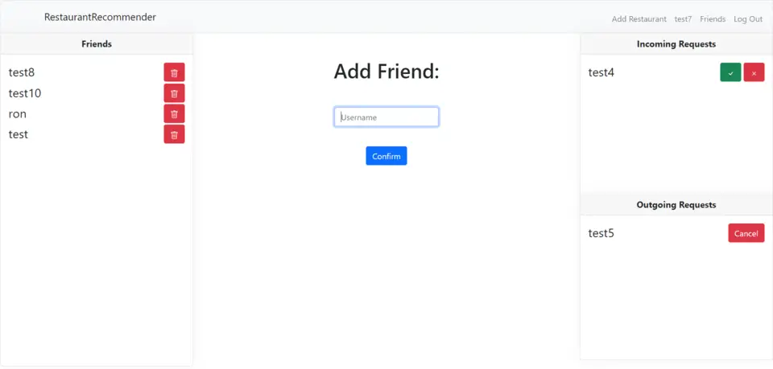

## Restaurant Recommender, Wouter Bentvelzen
Restaurant Recommender is een web app die het uitkiezen van een restaurant makkelijker maakt. Gebruikers kunnen hun eigen favoriete etablissement met naam en beschrijving op een kaart toevoegen, om makkelijker te onthouden waar men allemaal geweest is. Dit kan natuurlijk ook over een luchroom of koffietent gaan. Daarnaast kunnen gebruikers vrienden toevoegen, om de favoriete plekjes van elkaar te ontdekken en daar wellicht heen te gaan. Deze app is voor iedereen die wel eens moeite heeft met het uitzoeken van restaurants. 

## App demonstratie 
[Link naar video](https://video.uva.nl/media/Programmeerproject+Wouter+Bentvelzen+RestaurantRecommender/0_jqjb73s7)

### Installatie (in Ubuntu)
Download en unzip de code uit Github.

Installeer PostgreSQL:
Voor Mac gebruikers run: brew install postgresql
Voor Windows gebruikers zie de instructies van [Microsoft](https://learn.microsoft.com/en-us/windows/wsl/tutorials/wsl-database#install-postgresql)
Database beginnen:
Voor Mac run: brew services start postgresql
Voor windows run: sudo service postgresql start
Voor zowel Mac als Windows run: CREATE DATABASE restaurantrecommender;
En daarna: \c restaurantrecommender
Vervolgens:
- Binnen de map /Eindversie run: python3 -m pip install -r requirements.txt
- Als laatste voorbereiding run: export DATABASE_URL="postgresql://localhost/restaurantrecommender"
- Om de site te starten run de volgende command binnen /Eindversie directory: flask run --debug

## Bronvermelding
De code voor de kaart komt van Leafletjs en de kaart zelf van OpenStreetMap 2023
Voor bijna alle functionaliteiten op de kaart is ook gebruik gemaakt van code uit de LeafletJS library. 
De knop om de huidige locatie te vinden is Ruben Holthuijsen (C) 2020
